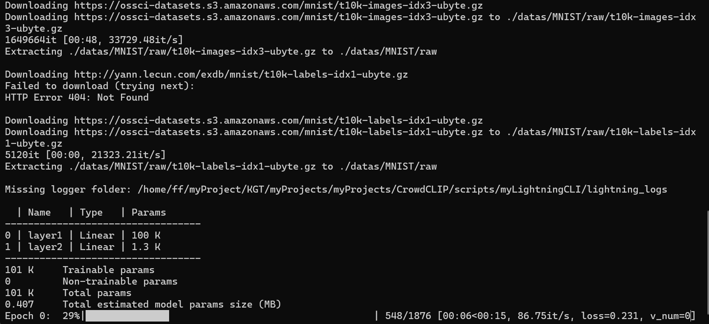
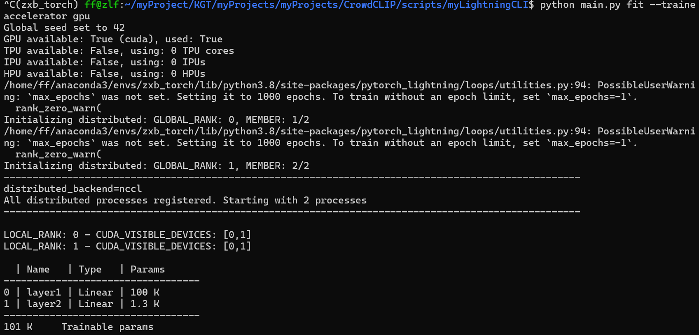
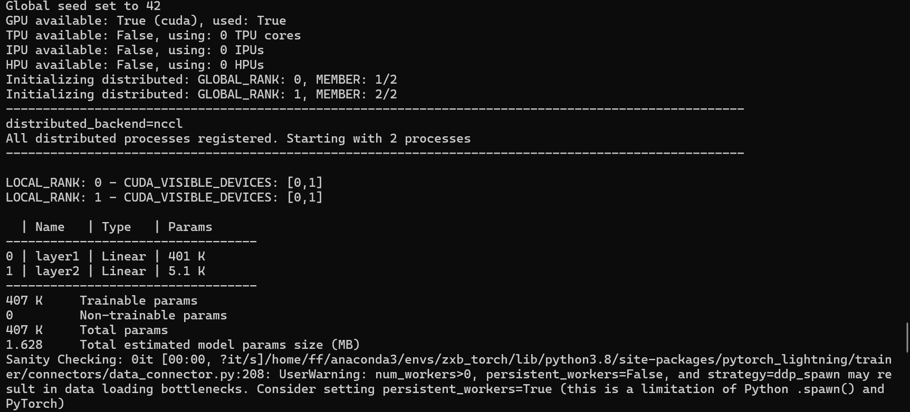
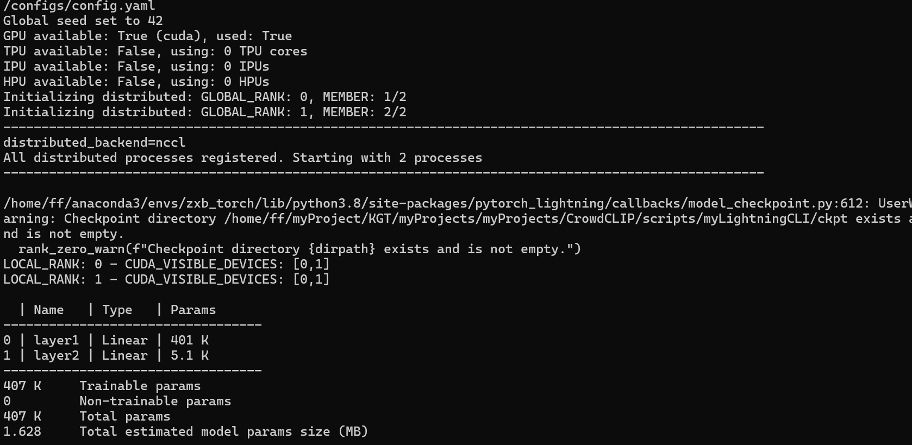
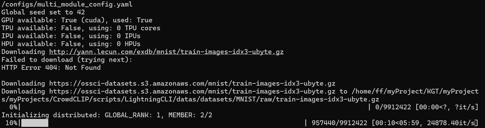
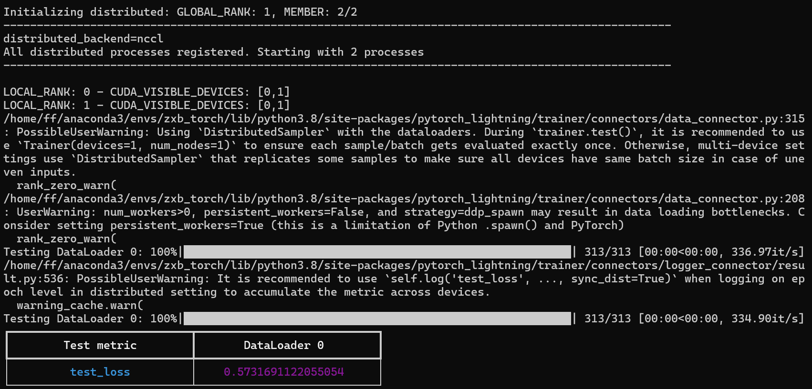

LightningCLI
-------------
想要了解LightningCLI怎么使用之前，建议先去看一下pytorch-lightning的使用教程
[PyTorch Lightning教程就看这篇（视频教程 + 文字教程）](https://mydreamambitious.blog.csdn.net/article/details/147851355?spm=1011.2415.3001.5331)

LightningCLI讲解

(1)文字教程[CSDN](https://blog.csdn.net/Keep_Trying_Go/article/details/155001802)

(2)视频教程[Bilibili平台](https://www.bilibili.com/video/BV13dUHBNEin/?pop_share=1&vd_source=b2eaaddb2c69bf42517a2553af8444ab)和
[抖音平台]()

```doctest
# cli_main_method_one
python main.py fit \
  --trainer.accelerator gpu
or 
python main.py fit \
  --config ./configs/default_config.yaml
```
CPU


GPU


```doctest
python main.py fit \
  --config ./configs/default_config.yaml
```


```doctest
# cli_main_method_two(single module)
python main.py fit \
  --config ./configs/config.yaml
```


```doctest
# cli_main_method_three(multi modules)
python main.py fit \
  --config ./configs/multi_module_config.yaml

```


```doctest
# train and yaml config
python main.py fit \
  --config ./configs/config.yaml 
  --model.learning_rate 0.0005
```

```doctest
python main.py test \
  --config ./configs/config.yaml \
  --ckpt_path ./lightning_logs/version_0/checkpoints/epoch=9-step=4299.ckpt

```

Custom LightningCLI
-------------

```doctest
python train.py fit --config ./configs/config.yaml
```


Reference Link
----------------
[https://github.com/omni-us/jsonargparse/tree/main](https://github.com/omni-us/jsonargparse/tree/main)
[https://lightning.ai/docs/pytorch/stable/cli/lightning_cli_advanced_2.html](https://lightning.ai/docs/pytorch/stable/cli/lightning_cli_advanced_2.html)
[https://lightning.ai/docs/pytorch/stable/cli/lightning_cli_expert.html](https://lightning.ai/docs/pytorch/stable/cli/lightning_cli_expert.html)
[https://pytorch-lightning.readthedocs.io/en/1.3.8/common/lightning_cli.html](https://pytorch-lightning.readthedocs.io/en/1.3.8/common/lightning_cli.html)
[https://lightning.ai/docs/overview/cli/studio](https://lightning.ai/docs/overview/cli/studio)
[PyTorch Lightning教程就看这篇（视频教程 + 文字教程）](https://mydreamambitious.blog.csdn.net/article/details/147851355?spm=1011.2415.3001.5331)
[]()
[]()
[]()


